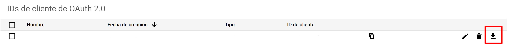

<h2 align="center">backup-to-cloud: the automatic google drive backup manager</font></h2>

<p align="center">
<a href="https://github.com/sralloza/backup-to-cloud/actions"></a>
<a href="https://github.com/sralloza/backup-to-cloud/actions"></a>
<a href="https://github.com/sralloza/backup-to-cloud/actions"></a>
<a href="https://codecov.io/gh/sralloza/backup-to-cloud">
  
</a>
<a href="https://github.com/sralloza/backup-to-cloud/blob/master/LICENSE"></a>
<a href="https://github.com/psf/black"></a>
</p>

Simple app designed to upload backups to google drive. Settings are handled by a yml file and it's explained [here](#settings). Before using the app, you need to get some google drive credentials, expained [here](#credentials).

## Settings

Settings must be placed in `.settings.yml`, written in [YAML](https://yaml.org/), in the root dir.

Each entry must be declared like this:

```yaml
name:
  type: <type>
  root-path: /path/to/file-or-folder
  cloud_folder_id: <folder_id>
  zip: true
  zipname: <zipname.zip>
  filter: <filter>
```

Notes:

- `name`, `type` and `root-path` are required.
- `zip` only affects behaviour if type is `multiple-files`.
- `zipname` only affects behaviour if type is `multiple-files` and `zip` is `true`.
- `filter` only affects behaviour if type is `multiple-files`.

Explanation:

- **name**: the name of the entry. It is irrelevant, only representative.
- **type**: the entry type. Right now it can be `single-file` or `multiple-files`.
- **root-path**: if type is `single-file`, it represents the path of the file. If type is `multiple-files`, it represents the root folder where the system will start listing files.
- **zip**: only used if the type is `multiple-files`. If True, the files will be zipped and uploaded as a single file, rather than multiple files.
- **zipname**: only used if type is `multiple-files` and `zip` is True. In that case, it must be provided. It sets the zip name to upload to google drive. Note that as it is a zip file, the extension should be `zip`.
- **cloud_folder_id**: id of the folder to save the file(s) into. If is not present or is `root`, the files will be stored in the root folder (`Drive`). More info for folder's id [here](#get-folders-id).
- **filter**: if the type is `multiple-files`, this regex filter will be applied to every file located below `root-path`. The search it's recursively. For example, to select all pdf files, use `filter=.py`. By default is `'.'`, which is a regex for match anything. It is encouraged to check the regex before creating the first backup. To check the regex read [this](#check-regex). If all you want to do is just filter files by extension, read [this](#common-filters). To write advanced filters, try [this web](https://regex101.com).

### Examples:

Back up apache configuration: saves all files with `conf` extension and saves them as a zip with name `sites-available.zip`, in a specific folder.

```yaml
apache-config:
  type: multiple-files
  root-path: /etc/apache2/sites-available
  zip: true
  zipname: sites-available.zip
  cloud_folder_id: <folder_id>
```

Back up a specific file.

```yaml
specific-file:
  type: single-file
  path: /home/user/data.db
  cloud_folder_id: <folder_id>
```

### Check regex

You can test if the regex matches the files you want to back up by using the command check-regex:

```bash
python launcher.py check-regex "<root-path>" "<regex>"
```

If `root-path` contains spaces, quotes (`"/path with/spaces"`) must be used.

### Common filters

One of the usages of the regex filter is filter by extension. In order to do so, write `filter=ext$` (where `ext` is the extension) in the settings file. The dollar symbol (*$*) means the end of the line. Without it, a file named `/folder/something.ext/invalid.pdf` would match the filter.

### Get folder's id

When opening the folder in the browser, the URL will look like `https://drive.google.com/drive/u/3/folders/<folder-id>`. The folder's id appears at the end of the URL. It has letters (lowercase and uppercase), numbers and hyphens.

## Credentials
In order to use this app, you need to get some credentials from the google drive api. If you don't have any projects created, create one in [this link](https://console.developers.google.com/projectcreate). After having a project, you need to generate credentials to talk to the API. To do so, visit [this link](https://console.developers.google.com/apis/credentials). After creating the credentials, download them.


When you press the download icon (as shown in the picture), a `json` file will be downloaded. Rename it to `credentials.json` and place it in the root folder (next to this file).

The file `credentials.json` is used to create the token, which the app uses to upload files into google drive. To create the token, run

```bash
python launcher.py gen-token
```

And that's all. You don't need to care about loosing data anymore!
